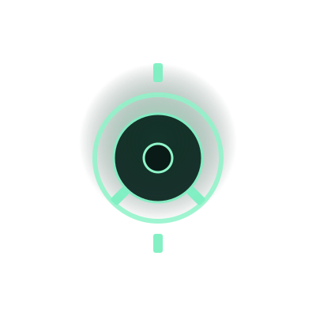

# Narco Cards: The Gathering — Design-System Dokumentation

## CSS-Variablen & Neon-Effects

Diese Dateien enthalten die exakten CSS-Variablen und Effekte basierend auf deinen Referenzbildern:

### css/variables.css
- Primäre Neon-Farben (Teal, Cyan, Bright)
- Sekundäre Farben (Pink, Purple)
- Hintergrund-Palette (dunkel bis mittel)
- Text-Farben (Primary bis Inactive)
- Button-States (default, hover, active)
- Glow & Shadow Effekte
- Transitions & Animationen
- Spacing, Border Radius, Fonts
- Letter Spacing (für Cyberpunk-Ästhetik)

### css/neon-effects.css
- `neon-glow-pulse` & `neon-glow-pulse-strong` Animationen
- `.glow-teal`, `.glow-teal-strong`, `.glow-pink` Klassen
- `.neon-text` & `.neon-text-bright` für Überschriften
- `.neon-border` & `.neon-border-strong` für Rahmen
- `.grid-bg` Gitter-Muster
- `.vignette` Kanten-Verdunkelung
- Button States: `.pill-btn`, `.left-item`
- `.holo-card` für Hologramm-Karte
- `.life-bar` für Health-Anzeige
- `.unit`, `.tc-card`, Tooltip, Toast Styles
- Accessibility: Focus-States

### Integration
- Alle CSS-Dateien sind in index.html linked (in richtiger Reihenfolge geladen)
- Variables werden als CSS Custom Properties definiert und können überall verwendet werden
- Neon-Effects sind als wiederverwendbare Klassen/Animationen implementiert

### Anwendungsbeispiele

```html
<!-- Neon-Text mit Glow -->
<h1 class="neon-text-bright">NARCO CARDS</h1>

<!-- Hologramm-Bild mit Puls-Animation -->


<!-- Button mit Neon-Effekt -->
<button class="pill-btn">Spielen</button>

<!-- Linkes Menü-Item (aktiv) -->
<button class="left-item active">PLAY</button>

<!-- Leben-Leiste mit Glow -->
<div class="life-bar"><div id="life-fill"></div></div>
```

## Live-Test
Branch: `feature/full-game`
Test-Link: https://raw.githack.com/c15780277-eng/Card-Game-1/feature/full-game/index.html
